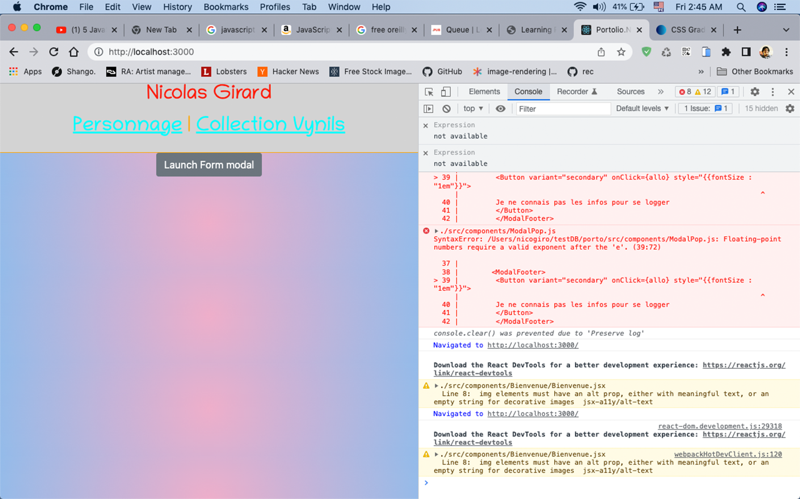

##portfolio pour montrer compétence 2022
L'idée générale est de monter une application, comportant la portion serveur et client en javascript

 [Le serveur de l'application](https://github.com/nico604/server).

Base de donnée Mysql (sqlite en ce moment)
Serveur et middleware Express

L'application est monté sur React 18 avec creat-react-app

À implémenter: 

Peaufiner réponse de Discog API pour afficher ma collection de vinyl.

Login avec serveur avec Passport.js

Simili-jeux avec react-game-engine

Utiliser l'api de Facebook

In the project directory, you can run:

### `npm start`

Runs the app in the development mode.\
Open [http://localhost:3000](http://localhost:3000) to view it in your browser.

